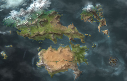
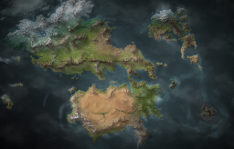
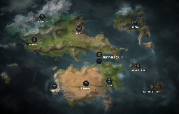
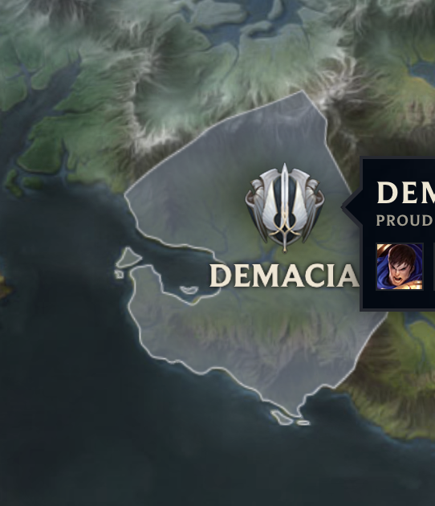
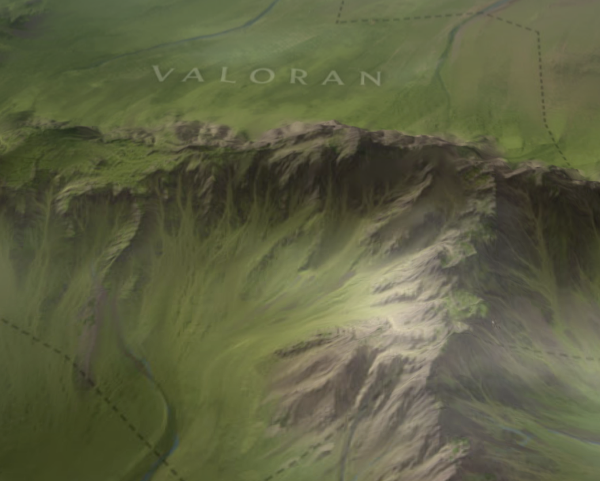

# Runeterra Clone

## Overview

Your task will be to reverse engineer [this website](https://map.leagueoflegends.com/en_US). Your version should resemble the map as close as possible, try to aim for 80% (arbitrarily judged later) likeness.

Your task is not to simply download the site's static resource, rather, it is to understand and implement. We will ask you questions later about how some things work and you must be able to answer them. You may use AI however you see fit to help you with this task.

## Feature Requirements

Below are some requirements, we require that you finish most of these. What `most` means is not fixed. We'll evaluate many aspects of your code and decide whether `most` has been met or not.

### Visual

_Hint: you can pull assets from the devtool_

#### Base Map

 

we should be able to pan and zoom around the map at 60fps.

#### Cloud Layers

 

Some clouds should be added on top of the map. The clouds should move across the map like tthe original and wrap around to the otherside when it falls off the screen.

#### Base Map with Vignette

 

Add some vignettes to make it look nice.

#### Base map with Icons

 

Add region icons on top of each map region.

#### Waves

Implement a moving wave on top of the ocean. It should also move across the plane. You may find resources on `noise` shaders useful.

#### UI Components

In general, all normal DOM components (side bar on the left and right) should match the look and feel of the original.

### Interactions

#### **Opening the Side Bar**

The side bar should open when the user clicks on a region.

#### **Color region on hover**

When the region is hovered, should display an overlay of that region. The tooltip detail is not required.

#### **Camera frustum clamping**. 

The camera's view (its frustum) should not be able to venture beyond the map. In the original lol map, you will see that you can never see what is beyond the edge of the map. This is not clamping the x and y position of the camera, but its projected view. 

#### **Camera zoom**. 

You should implement a camera zoom that when its `z` position reaches a certain point, the camera rotates a little (try zooming in in the original lol map).

#### **Map texture switch when zoomed in**

 

When you zoom in, you will notice that the map switches texture to a more detailed one. Implement this.

_Hint_

 

_you will need trigonometry_

#### Translation API with LLM

Connect with any small AI model to allow translation of this section to any language. . This is an additional requirement we added to gauge your ability to leverage AI models. You can try local LLM like gemini nano to access the [`prompt API`](https://developer.chrome.com/docs/extensions/ai/prompt-api) locally or call any third party LLM API. Add a dropdown somewhere that allows us to select a language of our choice. Doesn't have to be all languages in the world, at least 5 languages.

There are many regions, so you can just hardcode a couple of descriptions and randomly pick one every time the region is opened.

## Submission Requirements

- `readme.md` for how we can set up and run your project locally. 
- A deployed version of the project that we can just open in browsers.

## Useful Tools and Resources

### [r3f](https://r3f.docs.pmnd.rs/)

If you are familiar with React, you may find `r3f`'s API comfortable. It allows you compose 3D scenes, 

### [spectre.js](https://chromewebstore.google.com/detail/spectorjs/denbgaamihkadbghdceggmchnflmhpmk?hl=en)

For inspecting shaders pipeline within the browser, you may find this tool useful. 
